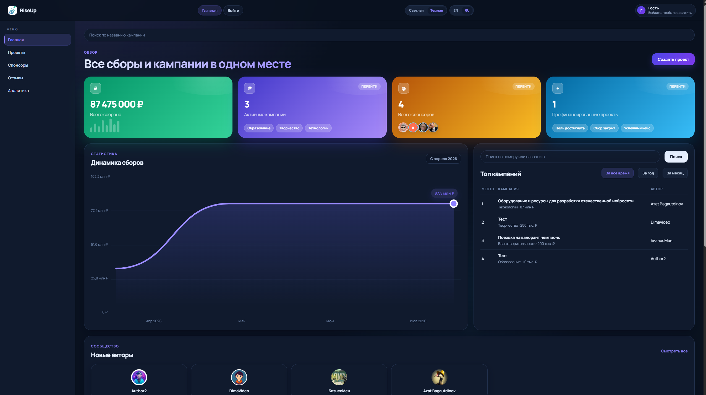
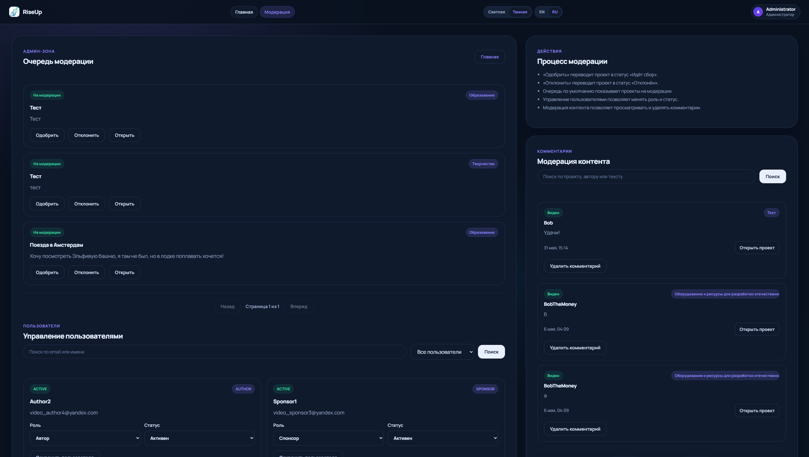

# CrowdFunding

CrowdFunding — веб-платформа для создания, модерации и финансирования краудфандинговых проектов. Авторы могут публиковать проекты и обновления, спонсоры — поддерживать проекты и отслеживать пожертвования, администраторы — модерировать контент и управлять пользователями.

    

## Основные возможности

- Регистрация пользователей и JWT-аутентификация.
- Ролевая модель `AUTHOR`, `SPONSOR` и `ADMIN`.
- Создание, редактирование и отправка проектов на модерацию.
- Жизненный цикл проекта: `DRAFT` → `MODERATION` → `ACTIVE` → `FUNDED` / `CLOSED`, также поддерживается статус `REJECTED`.
- Модерация проектов администратором.
- Категории проектов.
- Пожертвования и история пожертвований.
- Статусы платежей `PENDING`, `SUCCEEDED`, `FAILED` и `CANCELED`.
- Демонстрационный платёжный провайдер.
- Webhook для обновления статуса платежа.
- Комментарии и ответы на комментарии.
- Публикация обновлений проекта.
- Отзывы к проектам.
- Статистика проектов и личные кабинеты пользователей.
- Редактирование профиля, биографии и аватара.
- Административное управление пользователями, проектами и комментариями.
- Публичная витрина проектов, авторов и спонсоров.

## Роли пользователей

| Роль | Возможности |
|------|-------------|
| `AUTHOR` | Создание и управление проектами, публикация обновлений, просмотр статистики |
| `SPONSOR` | Поддержка проектов, просмотр истории пожертвований, комментарии и отзывы |
| `ADMIN` | Модерация проектов и контента, управление пользователями |

## Технологический стек

### Backend

- Java 21
- Spring Boot 3.4.2
- Spring Web
- Spring Data JPA
- Hibernate
- Spring Security
- JWT
- Jakarta Validation

### База данных

- PostgreSQL 16
- Flyway

### API

- REST API
- OpenAPI / Swagger UI

### Тестирование

- JUnit 5
- Spring Boot Test
- JaCoCo

### Инфраструктура

- Gradle
- Docker
- Docker Compose
- GitHub Actions

### Frontend

- Пользовательский интерфейс реализован на HTML, CSS и JavaScript и поставляется вместе со Spring Boot приложением из каталога статических ресурсов.

## Архитектура

Проект построен как одно Spring Boot приложение со слоистой архитектурой:

- `controller` — HTTP API.
- `service` — бизнес-логика.
- `repository` — доступ к данным.
- `entity` — модель базы данных.
- `dto` — контракты API.
- `mapper` — преобразование сущностей и DTO.
- `security` — JWT-аутентификация и авторизация.
- `payment` — абстракция платёжного провайдера.

```text
src/main/java/com/example/crowdfunding/
├── api/
│   ├── controller/
│   ├── dto/
│   ├── handler/
│   └── mapper/
├── config/
├── domain/
│   ├── entity/
│   ├── enums/
│   └── repository/
├── payment/
├── security/
└── service/
```

## Запуск проекта

### Требования

- Java 21
- Docker и Docker Compose
- Свободные порты `8080` и `5433`

### Запуск из исходного кода

1. Клонировать репозиторий:

```bash
git clone https://github.com/6yJlka/CrowdFunding.git
cd CrowdFunding
```

2. Запустить PostgreSQL:

```bash
docker compose up -d db
```

3. Запустить приложение.

Windows:

```powershell
.\gradlew.bat bootRun
```

Linux/macOS:

```bash
./gradlew bootRun
```

После запуска доступны:

- приложение: <http://localhost:8080>

### Запуск контейнеров

```bash
docker compose up -d
```

В `docker-compose.yml` сервис приложения использует опубликованный Docker image `6yjlka/crowdfunding:latest`. Compose-файл не собирает приложение из текущего локального исходного кода.

## Конфигурация

| Переменная | Назначение | Значение по умолчанию |
|------------|------------|-----------------------|
| `BOOTSTRAP_ADMIN_ENABLED` | Создание администратора при запуске | `false` |
| `BOOTSTRAP_ADMIN_EMAIL` | Email администратора | пусто |
| `BOOTSTRAP_ADMIN_PASSWORD` | Пароль администратора | пусто |
| `BOOTSTRAP_ADMIN_DISPLAY_NAME` | Отображаемое имя администратора | `Administrator` |

Настройки подключения к локальной PostgreSQL находятся в `src/main/resources/application.yml`.

## Демонстрационные платежи

> Платёжный модуль работает в демонстрационном режиме. `FakePaymentProvider` имитирует создание платежа и обработку webhook-уведомления. Реальные денежные операции не выполняются.

Платёжная интеграция построена через интерфейс `PaymentProvider`, поэтому демонстрационная реализация отделена от бизнес-логики обработки пожертвований и может быть заменена интеграцией с внешним платёжным сервисом.

## Тестирование

Windows:

```powershell
.\gradlew.bat test
```

Linux/macOS:

```bash
./gradlew test
```

Полная проверка:

```powershell
.\gradlew.bat clean build
```

После запуска тестов JaCoCo формирует HTML-отчёт:

```text
build/reports/jacoco/test/html/index.html
```

## CI/CD

В репозитории настроен GitHub Actions workflow, который:

- запускается при `push` в ветку `master`;
- поднимает PostgreSQL 16 для проверки приложения;
- собирает проект и запускает тесты через Gradle;
- собирает Docker image;
- публикует образ в Docker Hub;
- выполняет деплой через SSH.

## Статус проекта

Проект разработан как выпускная квалификационная работа в МГТУ им. Н. Э. Баумана. Репозиторий демонстрирует практическую реализацию backend-приложения на Java и Spring Boot: REST API, аутентификацию и авторизацию, работу с PostgreSQL, миграции базы данных, тестирование, контейнеризацию и CI/CD.

## Интерфейс

### Главная страница



### Каталог проектов


### Страница проекта


### Панель администратора

